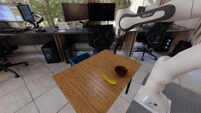

# DROID Sim Evaluation

This repository contains scripts for evaluating DROID policies in a simple ISAAC Sim environment.

Here is an example rollout of a pi0-FAST-DROID policy:



The simulation is tuned to work *zero-shot* with DROID policies trained on the real-world DROID dataset, so no separate simulation data is required.

**Note:** The current simulator works best for policies trained with *joint position* action space (and *not* joint velocity control). We provide examples for evaluating pi0-FAST-DROID policies trained with joint position control below.


## Installation

Clone the repo
```bash
git clone --recurse-submodules git@github.com:arhanjain/sim-evals.git
cd sim-evals
```

Install uv (see: https://github.com/astral-sh/uv#installation)

For example (Linux/macOS):
```bash
curl -LsSf https://astral.sh/uv/install.sh | sh
```

Create and activate virtual environment
```bash
uv sync
source .venv/bin/activate
```

Install extra dependencies
```bash
./submodules/IsaacLab/isaaclab.sh -i
```

## Quick Start

First, make sure you download the simulation assets and unpack them into the root directory of this package.
Using the AWS CLI, this can be done with:
```bash
aws s3 cp s3://openpi-assets-simeval/env_assets/simple_example/assets.zip .
unzip assets.zip
```

Then, in a separate terminal, launch the policy server on `localhost:8000`. 
For example, to launch a pi0-FAST-DROID policy (with joint position control),
change to the `submodules/openpi` directory and run the command below in a separate terminal
```bash
XLA_PYTHON_CLIENT_MEM_FRACTION=0.5 uv run scripts/serve_policy.py policy:checkpoint --policy.config=pi0_fast_droid_jointpos --policy.dir=s3://openpi-assets-simeval/pi0_fast_droid_jointpos
```

**Note**: We set `XLA_PYTHON_CLIENT_MEM_FRACTION=0.5` to avoid JAX hogging all the GPU memory (since Isaac Sim needs to use the same GPU).

Finally, run the evaluation script:
```bash
python run_eval.py --episodes 10 --headless
```

